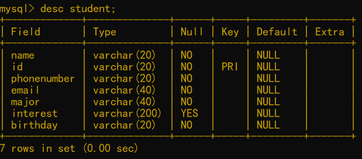

**Mydata —— A student information collection tool**
=======


Instruction
-----
MyData is a student information collection tool which can provide a portable way to collect students' name, id, phone number, email, major, interest and birthday.  
MyData possesses two clients.  
One is a website writed by _**html+css+javascript**_ which uses _**jQuery+jajx**_ to sent http request.  
The other is a command line app writed by _**Python**_ which uses _**requests**_ to sent http request.  
MyData's server is writed by _**Python**_ which uses _**flask**_ to response these requests.  
While the database we selected is _**MySQL**_ to save data.  

Project Structure
-----
1. #### client: The client of MyData
   * client.html: The website version
   * App.py: The command line version
   * template.json: The source template
   * layui: The style profile which is cited in client.html
2. #### server: The server of MyData
   * server.py: The server of MyData
   * data.sql: The origin data
3. #### pictures: The relative pictures in report
4. #### video: The videos that show features
   * video1: show website
   * video2: show command line App
5. #### dace.doc|.pdf: The report of this project
6. #### ReadMe.md: The readme of this project

Usage Steps
-----
1. ### Install the MySQL
      `The download link is https://www.mysql.com/`
2. ### Start your mysql service (This step is essential: if this service isn't start, MyData's server can't link to mysql)
      `start mysql net`
3. ### Create a mysql database named 'students' or you can change the database name in server.py to your database name
      ```
      mysql -h localhost -u root -p
      create database students;
      ```
4. ### Create a table named 'student' in 'students' database
      ```
      create table student(name varchar(20) not null,
      id varchar(20) not null,
      phonenumber varchar(20) not null,
      email varchar(40) not null,
      major varchar(40) not null,
      interest varchar(200),
      birthday varchar(20) not null,
      primary key (id));
      ```
      <a></a>
5. ### Run the server.py
      `python server.py`
6. ### Open the client.html in your brower or run the App.py
      `python App.py`
7. ### Before using MyData, you can import the data.sql into the student table


Update Log
-----
### V1.0 2022/12/22 
* update the code
* fix the bugs
* improve some features

Contributor
-----
* Writer: Wenzhuo Ma
* Email: 2574485753@qq.com
* If you have any problem regarding this project, please feal free to write to me.

